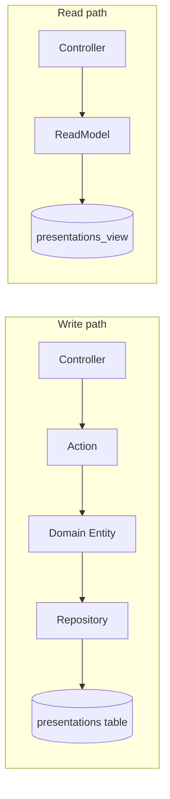
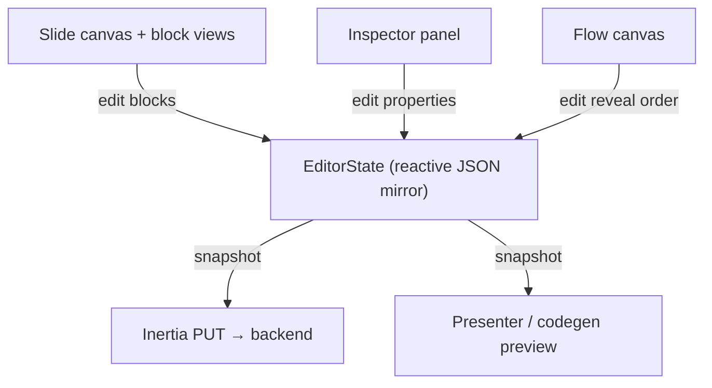
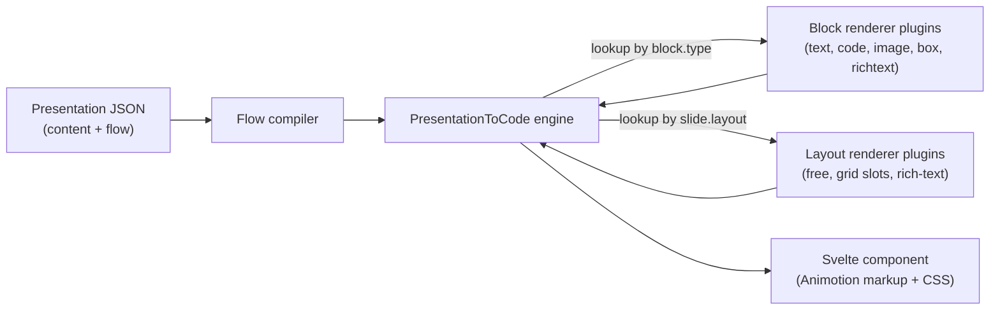
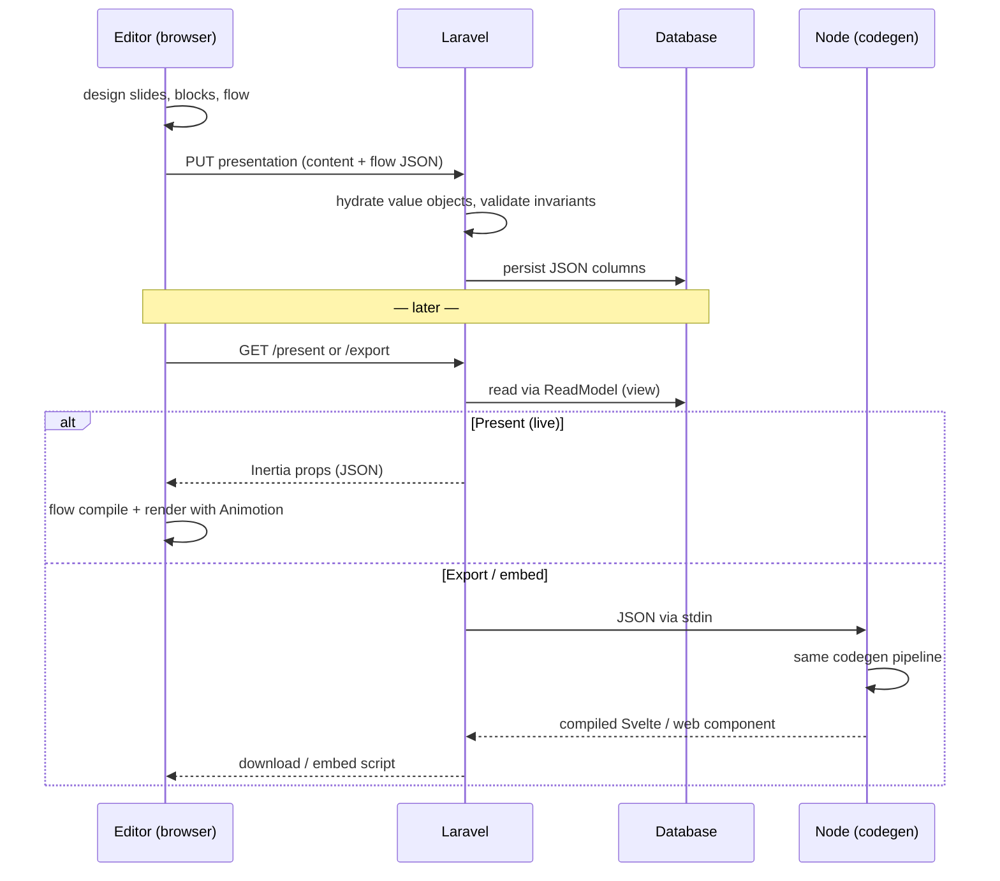

# Tecturn — Technical Overview

Tecturn is a presentation design and delivery tool. You design slides out of **blocks**, wire their reveal order in a **flow graph**, and the same JSON document drives the live presenter, the editor preview, and code export. This document explains the architecture at a high level.

## 1. Backend (Laravel)

The backend follows a pragmatic CQRS layering: writes go through Actions and a Repository, reads go through ReadModels backed by DB views. The domain layer is pure PHP.

Key points:

- A presentation is one aggregate (`PresentationEntity`) whose state is a tree of value objects: `PresentationContent` → `Slide[]` → slots → `Block[]`, plus a `FlowGraph` and `TalkSettings`.
- The whole design is persisted as **three JSON columns** on the `presentations` table: `content` (slides and blocks), `flow` (the flow graph), and `talk_settings`. There is no per-block table; the JSON document is the unit of storage.
- The domain validates invariants on save (for example, flow nodes must reference slides that exist in the content).
- The backend does **not** understand how to render slides. Rendering and code generation live entirely in TypeScript (see section 3); for exports, PHP shells out to Node rather than reimplementing the logic.

Relevant directories: `app/Domain/Presentation/` (entities, value objects, contracts), `app/Application/` (commands, actions), `app/Infrastructure/` (repository, read models), `app/Models/` (Eloquent, persistence only).

## 2. Frontend (Svelte 5 + Inertia)

The frontend has three consumers of the same presentation JSON:

1. **Editor** (`pages/presentations/Editor.svelte`) — the design stage.
2. **Presenter** (`components/tecturn/Presenter.svelte`) — live playback built on Animotion (reveal.js).
3. **Code generation** (`lib/tecturn/CodeGeneration/`) — turns the JSON into a standalone Svelte component for export and embeds.

### The design stage

The editor holds a reactive `EditorState` (Svelte 5 `$state`) that mirrors the backend types. Users compose slides from blocks (text, code, image, box, richtext), position them per layout (grid slots or free 16:9 canvas), and arrange reveal order on a node-based flow canvas.

### The flow graph

Reveal sequencing is a small graph DSL rather than nested markup. Everything is a node, in three lanes:

- **Slide nodes** — navigation order between slides (nav edges).
- **Transition nodes** — reveal steps within a slide; blocks are pinned to them.
- **Code-action nodes** — successive states of a code block (code morphing).

A **flow compiler** (`lib/tecturn/flow-compiler.ts`) turns this graph into a linear step sequence per slide. That compiled sequence is the single source of truth for reveal order, shared by the editor, the live presenter, and code generation, so all three always agree.

### The plugin-based rendering pipeline

Code generation is plugin-driven. A small IoC container holds two registries: **block renderers** (keyed by block type) and **layout renderers** (keyed by slide layout). The engine walks the compiled deck and dispatches every block and layout to its plugin; plugins return markup and CSS fragments, which the engine assembles into a single Svelte file.

Adding a new block type or layout means registering a new plugin on the container; the engine never changes. The live `Presenter` component renders the same compiled deck directly (no code generation step), so what you present matches what you export.

## 3. How they come together

The presentation JSON is the contract between the two sides. The backend owns storage and validation of that JSON; the frontend owns everything visual. Two mechanisms keep them in sync:

- **Type generation** — `php artisan typewriter:typegen` scans the PHP value objects and emits matching TypeScript types into `resources/js/types/generated/`. The editor, flow compiler, and codegen all consume those types, so the JSON shape is defined once, in PHP.
- **Single rendering codebase** — for server-side exports (standalone Svelte file, web component embed), PHP spawns a Node subprocess (`scripts/present.mjs`) that runs the exact same `CodeGeneration` module the browser uses. No rendering logic is duplicated in PHP.

In short: **design produces a JSON document → the backend stores and validates it → the flow compiler linearizes it → plugin renderers turn it into markup**, and that last stage runs identically in the browser (live) and in Node (export).
